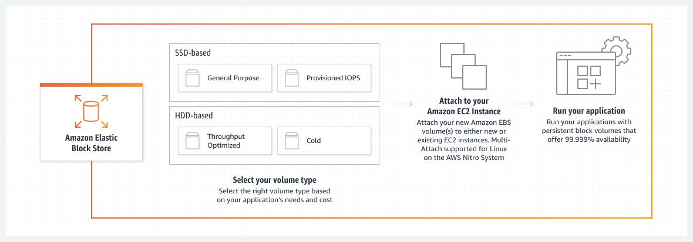

## Sobre o EBS
O Elastic Block Store (EBS) sao discos alocados em Storages fisicos em clusters e ligados via rede (NAS), proporcionando alta disponibilidade dos volumes alocados nas instancias e tambem a possibilidade de expansao ou locacao de novos discos nas instancias.

Link da Documentacao: https://aws.amazon.com/pt/ebs/

## Valores e tipos de EBS

s

